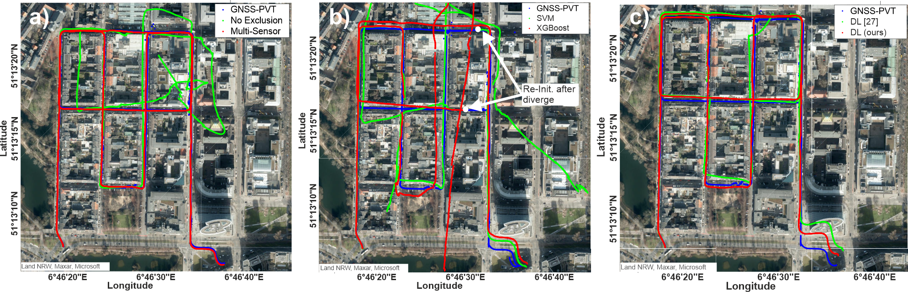

# Learning-based NLOS Detection and Uncertainty Prediction of GNSS Observations with Transformer-Enhanced LSTM Network

Data and Code will be published after 01.07.2023.

## Online Trajectory Estimation with NLOS Exclusion using different ML/DL Models

Vehicle Localization in Urban Area in Düsseldorf with NLOS Exclusion. The GNSS Positioning-Velocity-Timing (PVT) solution is shown in blue. Figure a) presents the estimated trajectory without NLOS exclusion and the solution by fusing GNSS observations and LiDAR odometry in a tight coupling. Figures b) and c) illustrate the estimated trajectories with NLOS exclusion using different learning models.

In this experiment, we infer our proposed network alongside other ML/DL models to identify the NLOS observations. The models are pre-trained with datasets from the cites of Hong Kong and Aachen. We choose the raw data from another measurement campaign in the city of Düsseldorf, which presents data Out-Of-Distribution for the pre-trained models.

